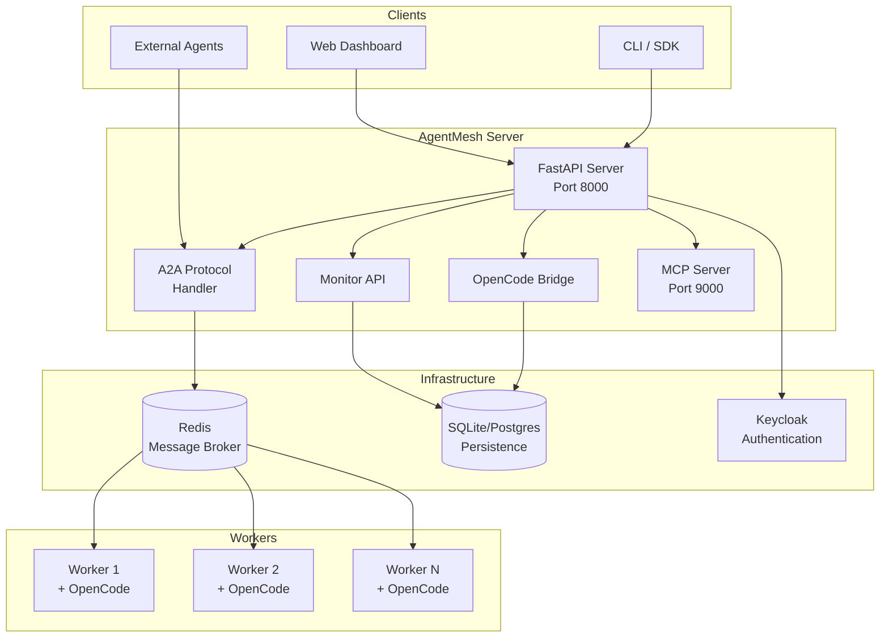
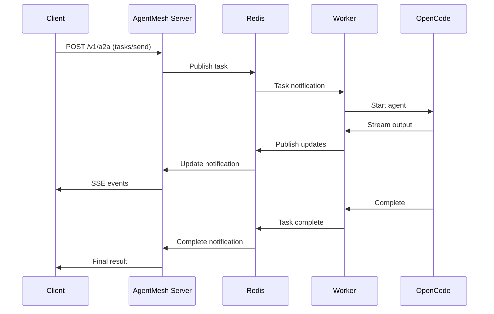
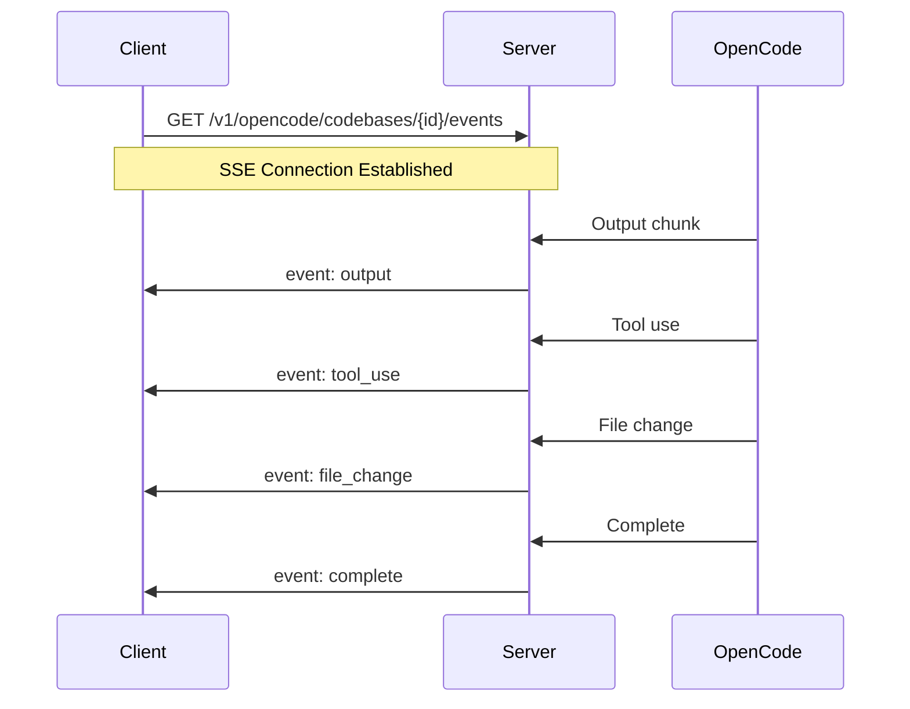

# Architecture

AgentMesh Server is designed as a modular, scalable system for running AI agents in production.

## High-Level Architecture



## Components

### FastAPI Server (Port 8000)

The main HTTP server handling:

- **A2A Protocol** (`/v1/a2a`) - JSON-RPC 2.0 agent communication
- **REST APIs** (`/v1/monitor/*`, `/v1/opencode/*`) - Management and monitoring
- **Agent Card** (`/.well-known/agent-card.json`) - A2A discovery
- **Health Check** (`/health`) - Liveness/readiness probes

### MCP Server (Port 9000)

Model Context Protocol server for tool integration:

- Expose AgentMesh capabilities as MCP tools
- Allow external agents to use AgentMesh tools
- Bridge between A2A and MCP protocols

### Message Broker (Redis)

Handles distributed communication:

- **Task Queue** - Distribute tasks to workers
- **Pub/Sub** - Real-time event distribution
- **Session State** - Shared state across instances

### OpenCode Bridge

Integrates AI coding agents:

- Register and manage codebases
- Trigger and control OpenCode agents
- Stream real-time agent output
- Manage session history

### Monitor API

Observability and management:

- Agent status and health
- Message history
- Real-time SSE streams
- Statistics and metrics

## Data Flow

### Task Execution Flow



### Real-time Streaming Flow



## Deployment Models

### Single Instance

Simplest deployment - everything in one process:

```
┌─────────────────────────────┐
│     AgentMesh Server        │
│  ┌─────────┐ ┌───────────┐  │
│  │ API     │ │ OpenCode  │  │
│  │ Server  │ │ Bridge    │  │
│  └─────────┘ └───────────┘  │
│  ┌─────────┐ ┌───────────┐  │
│  │ MCP     │ │ SQLite    │  │
│  │ Server  │ │ DB        │  │
│  └─────────┘ └───────────┘  │
└─────────────────────────────┘
```

### Distributed with Workers

Scale horizontally with dedicated workers:

```
┌─────────────────┐     ┌─────────────────┐
│ AgentMesh API   │     │ AgentMesh API   │
│ (Instance 1)    │     │ (Instance 2)    │
└────────┬────────┘     └────────┬────────┘
         │                       │
         └───────────┬───────────┘
                     │
              ┌──────┴──────┐
              │   Redis     │
              │   Cluster   │
              └──────┬──────┘
                     │
    ┌────────────────┼────────────────┐
    │                │                │
┌───┴───┐       ┌────┴────┐      ┌────┴────┐
│Worker │       │ Worker  │      │ Worker  │
│   1   │       │    2    │      │    N    │
└───────┘       └─────────┘      └─────────┘
```

### Kubernetes

Full production deployment:

```
┌─────────────────────────────────────────────────┐
│                  Kubernetes                      │
│  ┌─────────────────────────────────────────┐    │
│  │              Ingress                     │    │
│  │   agentmesh.run → API Service           │    │
│  └─────────────────────────────────────────┘    │
│                                                  │
│  ┌──────────────┐  ┌──────────────┐            │
│  │ API Pod 1    │  │ API Pod 2    │ ← HPA      │
│  │ (Deployment) │  │ (Deployment) │            │
│  └──────────────┘  └──────────────┘            │
│                                                  │
│  ┌──────────────┐  ┌──────────────┐            │
│  │ Worker Pod 1 │  │ Worker Pod 2 │ ← HPA      │
│  │ (StatefulSet)│  │ (StatefulSet)│            │
│  └──────────────┘  └──────────────┘            │
│                                                  │
│  ┌──────────────┐  ┌──────────────┐            │
│  │    Redis     │  │   Postgres   │            │
│  │ (StatefulSet)│  │ (StatefulSet)│            │
│  └──────────────┘  └──────────────┘            │
└─────────────────────────────────────────────────┘
```

## Security Model

### Authentication Layers

1. **Ingress** - TLS termination, rate limiting
2. **API Gateway** - Token validation, OIDC
3. **Service** - Role-based access control
4. **Data** - Encryption at rest

### Network Security

- Internal services communicate via ClusterIP
- External access only through Ingress
- Redis protected by NetworkPolicy
- Secrets managed via Kubernetes Secrets or Vault

## Next Steps

- [Installation](../getting-started/installation.md)
- [Kubernetes Deployment](../deployment/kubernetes.md)
- [Distributed Workers](distributed-workers.md)
