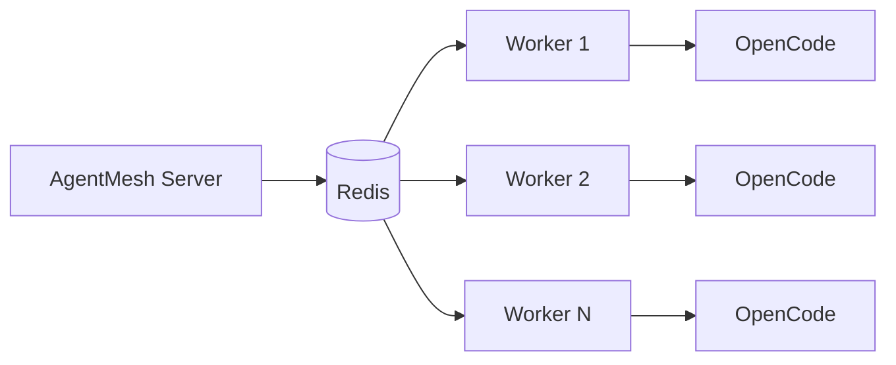

# Distributed Workers

AgentMesh supports distributed workers, allowing you to scale AI agent execution across multiple machines.

## Overview

Workers are separate processes that:

- Connect to the AgentMesh server
- Poll for assigned tasks
- Execute tasks using local OpenCode installation
- Report results back to the server

## Quick Start

### 1. Install Worker

```bash
pip install a2a-server-mcp
```

### 2. Configure Worker

Create `/etc/a2a-worker/config.json`:

```json
{
  "server_url": "https://agentmesh.example.com",
  "worker_name": "worker-1",
  "poll_interval": 5,
  "codebases": [
    "/home/user/project-a",
    "/home/user/project-b"
  ]
}
```

### 3. Start Worker

```bash
agentmesh worker --config /etc/a2a-worker/config.json
```

## Worker Architecture



## Configuration Options

| Option | Default | Description |
|--------|---------|-------------|
| `server_url` | — | AgentMesh server URL |
| `worker_name` | hostname | Unique worker identifier |
| `poll_interval` | 5 | Seconds between task polls |
| `codebases` | [] | Paths to registered codebases |
| `max_concurrent` | 1 | Max concurrent tasks |

## Environment Variables

```bash
export A2A_SERVER_URL=https://agentmesh.example.com
export A2A_WORKER_NAME=worker-1
export A2A_POLL_INTERVAL=5
```

## Systemd Service

Create `/etc/systemd/system/a2a-worker.service`:

```ini
[Unit]
Description=AgentMesh Worker
After=network.target

[Service]
Type=simple
User=agentmesh
ExecStart=/usr/local/bin/agentmesh worker --config /etc/a2a-worker/config.json
Restart=always
RestartSec=10

[Install]
WantedBy=multi-user.target
```

Enable and start:

```bash
sudo systemctl enable a2a-worker
sudo systemctl start a2a-worker
```

## Codebase Registration

Register codebases with worker affinity:

```bash
curl -X POST https://agentmesh.example.com/v1/opencode/codebases \
  -H "Content-Type: application/json" \
  -d '{
    "name": "my-project",
    "path": "/home/user/my-project",
    "worker_id": "worker-1"
  }'
```

Tasks for this codebase will only be assigned to `worker-1`.

## Scaling

### Horizontal Scaling

Add more workers to handle more concurrent tasks:

```bash
# Worker 1
agentmesh worker --name worker-1

# Worker 2
agentmesh worker --name worker-2

# Worker N
agentmesh worker --name worker-N
```

### Kubernetes Deployment

```yaml
apiVersion: apps/v1
kind: StatefulSet
metadata:
  name: agentmesh-worker
spec:
  replicas: 3
  selector:
    matchLabels:
      app: agentmesh-worker
  template:
    spec:
      containers:
      - name: worker
        image: ghcr.io/rileyseaburg/agentmesh-worker:latest
        env:
        - name: A2A_SERVER_URL
          value: "http://agentmesh-api:8000"
        - name: A2A_WORKER_NAME
          valueFrom:
            fieldRef:
              fieldPath: metadata.name
```

## Monitoring

Check worker status:

```bash
curl https://agentmesh.example.com/v1/monitor/workers
```

```json
{
  "workers": [
    {
      "id": "worker-1",
      "status": "active",
      "last_heartbeat": "2025-12-10T15:30:00Z",
      "tasks_completed": 42
    }
  ]
}
```

## Next Steps

- [Architecture](../concepts/architecture.md)
- [Kubernetes Deployment](../deployment/kubernetes.md)
