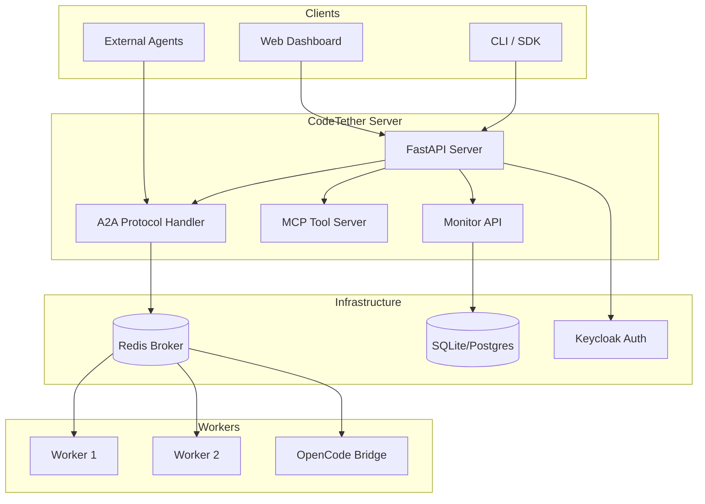

# CodeTether Server

**Turn AI Agents Into Production Systems.**

CodeTether Server is a production-ready implementation of the [A2A (Agent-to-Agent) Protocol](https://a2a-protocol.org/), the open standard from the Linux Foundation that enables AI agents to communicate, collaborate, and solve complex problems together.

<div class="grid cards" markdown>

-   :material-rocket-launch:{ .lg .middle } __Get Started in 5 Minutes__

    ---

    Install CodeTether and run your first multi-agent workflow

    [:octicons-arrow-right-24: Quick Start](getting-started/quickstart.md)

-   :material-api:{ .lg .middle } __Full A2A Protocol Support__

    ---

    Complete implementation of the A2A specification with extensions

    [:octicons-arrow-right-24: A2A Protocol](concepts/a2a-protocol.md)

-   :material-kubernetes:{ .lg .middle } __Deploy Anywhere__

    ---

    Docker, Kubernetes, or bare metal with Helm charts included

    [:octicons-arrow-right-24: Deployment](deployment/docker.md)

-   :material-code-braces:{ .lg .middle } __OpenCode Integration__

    ---

    Bridge AI coding agents to your codebase with session management

    [:octicons-arrow-right-24: OpenCode](features/opencode.md)

</div>

---

## What is CodeTether?

CodeTether Server provides the infrastructure layer for running AI agents in production:

- **A2A Protocol Native** — Full implementation of the [A2A specification](https://a2a-protocol.org/specification.md) for agent-to-agent communication
- **Distributed Workers** — Run agents across multiple machines with automatic task routing
- **Real-time Streaming** — SSE-based live output streaming for long-running agent tasks
- **Session Management** — Resume conversations, sync across devices, maintain context
- **Enterprise Security** — Keycloak OIDC, API tokens, audit logging
- **OpenCode Bridge** — Native integration with OpenCode AI coding agents

## A2A Protocol Implementation

CodeTether implements the complete A2A Protocol specification:

| A2A Feature | CodeTether Support | Reference |
|-------------|-------------------|-----------|
| Agent Discovery | ✅ `/.well-known/agent-card.json` | [Spec §5](https://a2a-protocol.org/specification.md#5-agent-discovery-the-agent-card) |
| JSON-RPC 2.0 | ✅ Full support | [Spec §6](https://a2a-protocol.org/specification.md#6-protocol-data-objects) |
| Task Management | ✅ Create, cancel, status | [Spec §7](https://a2a-protocol.org/specification.md#7-json-rpc-methods) |
| Streaming (SSE) | ✅ Real-time artifacts | [Spec §8](https://a2a-protocol.org/specification.md#8-streaming-sse) |
| Push Notifications | ✅ Webhook callbacks | [Topics](https://a2a-protocol.org/topics/streaming-and-async.md) |
| Multi-turn Conversations | ✅ Session continuity | [Topics](https://a2a-protocol.org/topics/key-concepts.md) |

Plus CodeTether extensions:

- **Distributed Task Queue** — Redis-backed task distribution across workers
- **OpenCode Integration** — AI coding agent bridge with codebase registration
- **Monitor UI** — Web dashboard for real-time agent observation
- **MCP Tools** — Model Context Protocol tool server

## Quick Example

```bash
# Install
pip install a2a-server-mcp

# Run server
codetether serve --port 8000

# In another terminal, send a task
curl -X POST http://localhost:8000/v1/a2a \
  -H "Content-Type: application/json" \
  -d '{
    "jsonrpc": "2.0",
    "method": "tasks/send",
    "params": {
      "message": {
        "role": "user",
        "parts": [{"text": "Analyze this codebase"}]
      }
    },
    "id": "1"
  }'
```

## Architecture Overview



## Next Steps

<div class="grid cards" markdown>

-   :material-download:{ .lg .middle } __Installation__

    [:octicons-arrow-right-24: Install Guide](getting-started/installation.md)

-   :material-cog:{ .lg .middle } __Configuration__

    [:octicons-arrow-right-24: Config Reference](getting-started/configuration.md)

-   :material-api:{ .lg .middle } __API Reference__

    [:octicons-arrow-right-24: API Docs](api/overview.md)

-   :material-github:{ .lg .middle } __Source Code__

    [:octicons-arrow-right-24: GitHub](https://github.com/rileyseaburg/A2A-Server-MCP)

</div>
